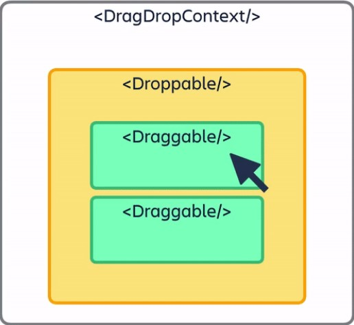

# React Beautiful dnd Tutorial

react-beautiful-dnd exists to create beautiful drag and drop for lists. Visit [official website](https://github.com/atlassian/react-beautiful-dnd) for more information.

## Installation

```
# yarn
yarn add react-beautiful-dnd

# npm
npm install react-beautiful-dnd --save
```

## Concept



image from: https://github.com/atlassian/react-beautiful-dnd

1. `<DragDropContext />` - wraps the part of your application you want to have drag and drop.
2. `<Droppable />` - an area that can be dropped into. Contains `<Draggable />`
3. `<Draggable />` - what can be dragged around

## Vertical lists

1. Wraps the part of your app that you want to drag and drop with `<DragDropContent />`

2. Wraps the area that can be dropped into with `<Droppable />`
   and also add `droppableId` property which is arbitrary string.
   `<Droppable />` need to return child as a function. Thus, write function and receive provided as a prop.

3. Wraps the part that you want to drag with `<Draggable />`

```js
// App.js
import React, { useState } from 'react';
import { DragDropContext, Droppable } from 'react-beautiful-dnd';
import data from './data.json';
import Movie from './components/Movie';

function App() {
  const [movies, setMovies] = useState(data.movies);

  const handleOnDragEnd = (result) => {
    if (!result.destination) return;
    const newMovies = [...movies];
    const [reorderedItem] = newMovies.splice(result.source.index, 1);
    newMovies.splice(result.destination.index, 0, reorderedItem);

    setMovies(newMovies);
  };

  return (
    <div className="App">
      <h2>Movies List</h2>
      <DragDropContext onDragEnd={handleOnDragEnd}>
        <Droppable droppableId="movies">
          {(provided) => (
            <ul
              className="movie-list"
              {...provided.droppableProps}
              ref={provided.innerRef}
            >
              {movies.map((movie, index) => {
                return (
                  <Movie
                    id={movie.id}
                    index={index}
                    key={movie.id}
                    title={movie.title}
                    year={movie.year}
                    director={movie.director}
                  />
                );
              })}
              {provided.placeholder}
            </ul>
          )}
        </Droppable>
      </DragDropContext>
      <p className="copyright">Copyright © 2021 Chitsanupong Tangvasinkul</p>
    </div>
  );
}

export default App;
```

```js
// Movie.js
import React from 'react';
import { Draggable } from 'react-beautiful-dnd';

const Movie = ({ id, index, title, year, director }) => {
  return (
    <Draggable draggableId={id.toString()} index={index} key={id}>
      {(provided) => (
        <li
          className="movie"
          key={id}
          {...provided.draggableProps}
          {...provided.dragHandleProps}
          ref={provided.innerRef}
        >
          <h4>Title: {title}</h4>
          <p>Year: {year}</p>
          <p>Director: {director}</p>
        </li>
      )}
    </Draggable>
  );
};

export default Movie;
```

## Snapshot

snapshot is a prop like provided prop which can be used to get isDragging or isDraggingOver value.
You can use snapshot to change styles when dragging like changing background color.

## Horizontal lists

Changing drag & drop direction with direction property in `<Droppable>`.

```js
 <Droppable droppableId="movies" direction="horizontal">...<Droppable>
```
